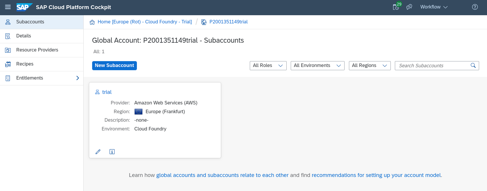
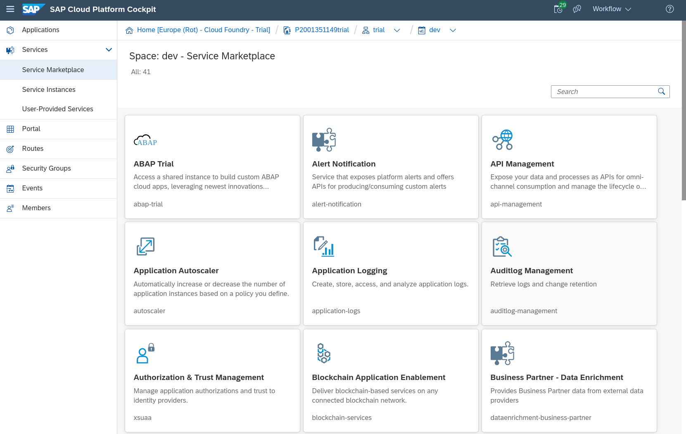
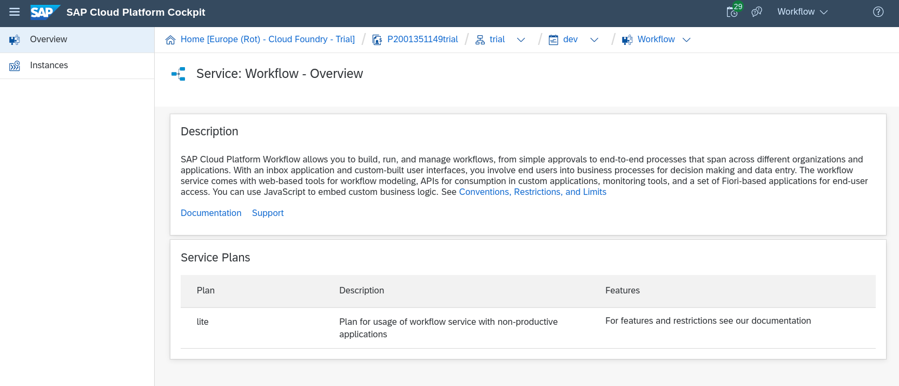
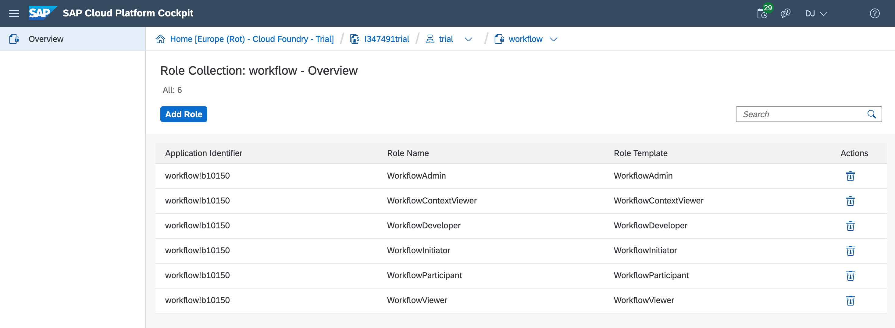
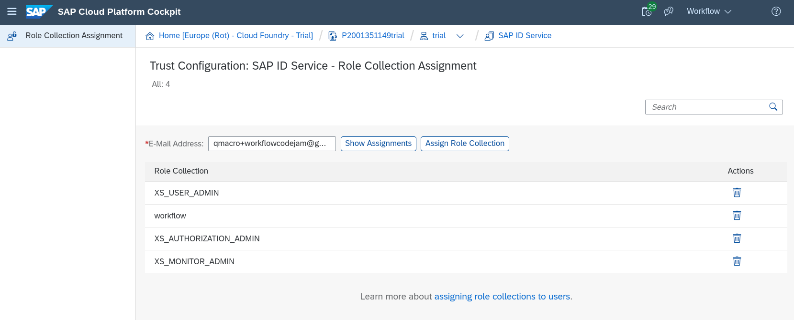
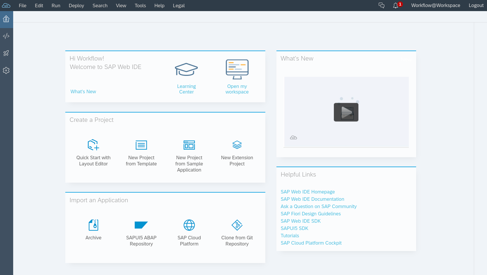
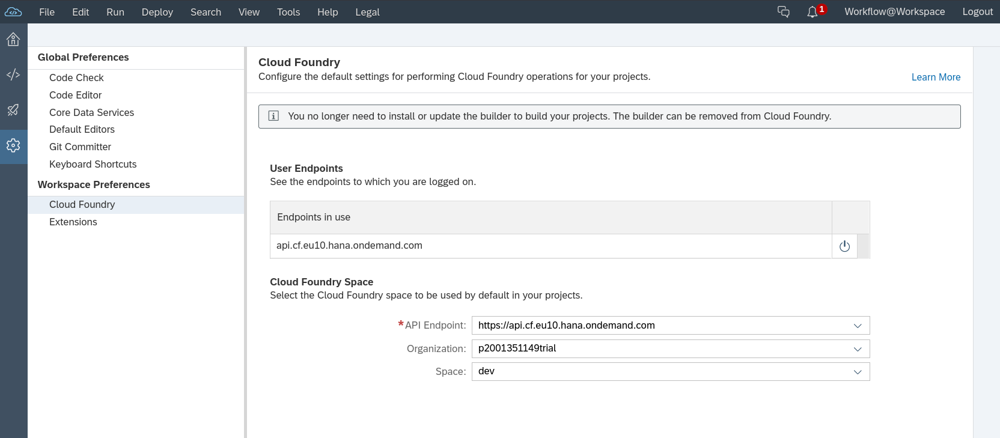

# Exercise 01 - Setting up for Workflow on Cloud Foundry

In this exercise you'll set up and configure the basic aspects that you'll need to complete this Workflow CodeJam on SAP Cloud Platform, specifically in the Cloud Foundry (CF) environment.

From a service perspective, you'll be using a number of services from the start:

- Workflow: the engine and infrastructure that supports workflow generally
- Portal: to support the Fiori Launchpad (FLP) site which will host the Workflow-related apps
- HTML5 Application Repository: where the core Workflow-related apps are stored and served from
- Authorization & Trust Management: to manage application authorizations and trust to identity providers

You will also need an editor, or an Interactive Development Environment (IDE) to create and maintain your workflow definitions. For that you will be using the SAP Web IDE.

Finally, you'll be playing different roles throughout this CodeJam, using your SAP Cloud Platform trial user. To that end, you'll need the appropriate authorizations:

- Workflow Administrator
- Workflow Developer
- Workflow Initiator
- Workflow Participant
- Workflow Viewer

## Steps

After completing the steps in this exercise you'll have appropriate authorizations set up and assigned to your user, an IDE setup and configured to work with Workflow artifacts, and an instance of the main Workflow service set up explicitly. Instances of the other services mentioned earlier will be set up implicitly in the next exercise.

### 1. Log on to the SAP Cloud Platform Cockpit and look around

You'll be managing and using services via the SAP Cloud Platform Cockpit in this CodeJam, so it's worth spending a couple of minutes making yourself familiar with it.

:point_right: Go to the trial cockpit landing page at <https://cockpit.hanatrial.ondemand.com/cockpit/#/home/trial> and log on if you're not already authenticated. You should be presented with a welcome page, with a couple of main buttons near the top, to "Enter Your Trial Account" and "Launch SAP Web IDE".

If you've created your SAP Cloud Platform trial account according to the [prerequisites](../../prerequisites.md), you should see something like this, showing a single SAP Cloud Platform subaccount named "trial" (this is the default name for a new, automatically provisioned subaccount) within your trial global account:

Note the "Environment" shown in the subaccount detail shows "Cloud Foundry".

:point_right: Select your "trial" subaccount to get an overview, where you'll see that a CF organization has also been automatically provisioned for you and linked to the subaccount. If you chose the default location, the API endpoint for your CF organization will also be `https://api.cf.eu10.hana.ondemand.com`. Note also that a default space called "dev" has been set up for you too:

:point_right: In the menu on the left hand side, select "Spaces" to see the list of spaces in the CF organization - this should show your "dev" space as a tile, including the quota assigned to it and how much of that quota has been used. A newly provisioned CF organization and space should have adequate resources available for what we want to achieve in this CodeJam today:

While you're looking at the list of spaces here, notice the menu item "Security" on the left. Expand it to see "Administrators", "Role Collections" and "Trust Configuration" within it. You'll be using these menu items later to set up roles for yourself, so familiarize yourself with where they in the breadcrumb trail at the top:

**Home [Europe (Rot) - Cloud Foundry - Trial] / \<your trial global account\> / \<your trial subaccount\>**

This trail leads you to the CF specific view of your subaccount.

### 2. Set up a Workflow service instance in your CF space

At this point you're ready to create an instance of the Workflow service.

:point_right: Select your "dev" (or equivalent) space from the "Spaces" page shown in the previous screenshot, to bring yourself to the level of that space, where you can deploy applications and create and manage instances of services, amongst other things. Expand the "Services" menu item on the left and select the "Service Marketplace" to see the services available to you. You should see an entry for each of the services listed at the start of this exercise:

:point_right: Find and select the Workflow service which should bring you to an overview, where the available "Service Plans" are listed. This should include a "lite" plan which is what you need.

:point_right: Using the "Instances" menu item on the left, create a new instance with the "lite" service plan by using the "New Instance" button and following the dialog flow, paying attention at each of the steps:

- Step "Choose Service Plan": make sure you select the "lite" plan
- Step "Specify Parameters (Optional)": leave everything as-is
- Step "Assign Application (Optional)": leave everything as-is
- Step "Confirm": specify `workflow` as the instance name, leave everything else as-is

The instance name `workflow` is important as you'll refer to it later.

### 3. Create a role and assign it to yourself

Now you have a Workflow service instance in your space, it's time to assign workflow roles to yourself.

:point_right: Using the breadcrumb trail remarked upon earlier, go back to the subaccount's CF overview and select the "Role Collections" menu item within the "Security" menu item on the left.

> The observant amongst you will have noticed that the quota display for the "dev" space has now changed to reflect that there's a service instance now existing (and taking up a slot in the quota - if it's a fresh space it will say something like "1 of 40 services").

:point_right: Add a new role collection with the "New Role Collection" button, giving it the name `workflow`. Select it from the list when it appears, to add roles to it.

:point_right: In the role collection overview that appears when you select the role collection, use the "Add Role" multiple times to add the five roles mentioned at the start of this exercise. Make sure you specify the correct Application Identifier each time - it will begin "workflow" and be joined to an identifier with a "!" symbol, something like this:

`workflow!b10150`

> It doesn't matter if the identifier is different to this example.

When you're done, the collection should look like this:

At this stage you have a new role collection; now you need to assign it to yourself.

:point_right: Go back to where you started this step from, and select the "Trust Configuration" item from within the "Security" menu item, where you should see an existing entry for the default identity provider (the SAP ID service):

:point_right: Select the "SAP ID Service" link and in the following screen, enter the email address associated with the trial account you're using, and select the "Show Assignments" button. Then use the "Assign Role Collection" button to select and assign the new "workflow" role collection you just created.

At this stage you're all set with the main Workflow service and have access to use it.

### 4. Set up the SAP Web IDE

Now it's time to set up the IDE you'll be using, which in this case is the SAP Web IDE. You'll configure it to use a special "Workflow Editor" extension, and also specify your CF details to connect to.

:point_right: Jump back to the landing page by clicking on the "SAP Cloud Platform Cockpit" link right at the top of the page, then use the "Launch SAP Web IDE" button you saw earlier, to start the IDE, which should present itself to you like this:

There are different perspectives that this IDE supports, with icons on the far left to jump to them. The perspectives include "Home" (where you are now), "Editor" (identified with angle-brackets icon), "Storyboard" (rocket icon) and "Preferences" (cog icon).

:point_right: Select the "Preferences" perspective, and within the "Workspace Preferences" choose first the "Cloud Foundry" entry. In the "Cloud Foundry Space" settings, specify the details for the API Endpoint, Organization and Space you're using. Remember that the API Endpoint is something that you looked at briefly earlier in this exercise. While specifying these details, you'll be asked to provide authentication information. Finally, don't forget to select the "Save" button at the bottom of the page.

What you end up with should look something like this:

:point_right: Now choose the "Extensions" entry within the "Workspace Preferences" and search for the "Workflow Editor" extension. Make sure it's switched to "ON" and hit "Save" at the bottom again. You may need to allow the IDE to restart at this point.

## Summary

At this point you're all set up to embark upon your Workflow service journey, with an instance of the main Workflow service available to you, and an IDE that can help you build and manage workflow definitions and make deployments to your CF environment on SAP Cloud Platform.

## Questions

1. What are the relationships between SAP Cloud Platform subaccounts, Cloud Foundry organizations and spaces?

1. While you've set up the SAP Web IDE, what other options might you have for this CodeJam?
