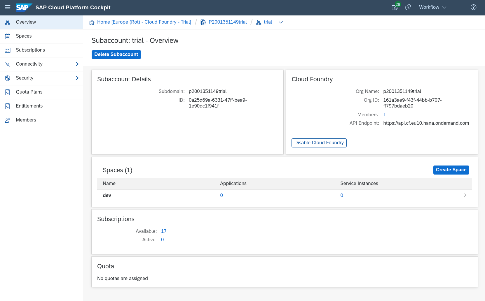
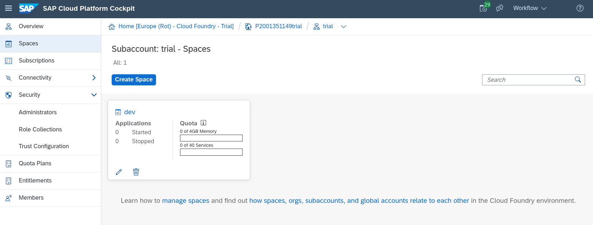

# Exercise 01 - Setting up for Workflow on Cloud Foundry

In this exercise you'll set up and configure the basic aspects that you'll need to complete this Workflow CodeJam on SAP Cloud Platform, specifically in the Cloud Foundry (CF) environment.

From a service perspective, you'll be using a number of services from the start:

- Workflow: the engine and infrastructure that supports workflow generally
- Portal: to support the Fiori Launchpad (FLP) site which will host the Workflow-related apps
- HTML5 Application Repository: where the core Workflow-related apps are stored and served from
- Authorization & Trust Management: to manage application authorizations and trust to identity providers

You will also need an editor, or an Interactive Development Environment (IDE) to create and maintain your workflow definitions. For that you will be using the SAP Web IDE.

Finally, you'll be playing different roles throughout this CodeJam, using your SAP Cloud Platform trial user. To that end, you'll need the appropriate authorizations:

- Workflow Administrator
- Workflow Developer
- Workflow Initiator
- Workflow Participant
- Workflow Viewer

## Steps

After completing the steps in this exercise you'll have appropriate authorizations set up and assigned to your user, an IDE setup and configured to work with Workflow artifacts, and an instance of the main Workflow service set up explicitly. Instances of the other services mentioned earlier will be set up implicitly in the next exercise.

1. Log on to the SAP Cloud Platform Cockpit and look around

You'll be managing and using services via the SAP Cloud Platform Cockpit in this CodeJam, so it's worth spending a couple of minutes making yourself familiar with it.

:point_right: Go to the trial cockpit landing page at <https://cockpit.hanatrial.ondemand.com/cockpit/#/home/trial> and log on if you're not already authenticated. You should be presented with a welcome page, with a couple of main buttons near the top, to "Enter Your Trial Account" and "Launch SAP Web IDE".

If you've created your SAP Cloud Platform trial account according to the [prerequisites](../../prerequisites.md), you should see something like this, showing a single SAP Cloud Platform subaccount named "trial" (this is the default name for a new, automatically provisioned subaccount) within your trial global account:

Note the "Environment" shown in the subaccount detail shows "Cloud Foundry".

:point_right: Select your "trial" subaccount to get an overview, where you'll see that a CF organization has also been automatically provisioned for you and linked to the subaccount. If you chose the default location, the API endpoint for your CF organization will also be `https://api.cf.eu10.hana.ondemand.com`. Note also that a default space called "dev" has been set up for you too:

:point_right: In the menu on the left hand side, select "Spaces" to see the list of spaces in the CF organization - this should show your "dev" space as a tile, including the quota assigned to it and how much of that quota has been used. A newly provisioned CF organization and space should have adequate resources available for what we want to achieve in this CodeJam today:

While you're looking at the list of spaces here, notice the menu item "Security" on the left. Expand it to see "Administrators", "Role Collections" and "Trust Configuration" within it. You'll be using these menu items later to set up roles for yourself, so familiarize yourself with where they in the breadcrumb trail at the top:

**Home [Europe (Rot) - Cloud Foundry - Trial] / <your trial global account> / <your trial subaccount>**

