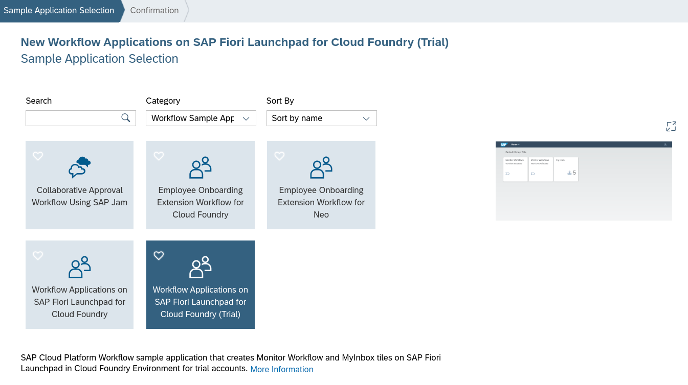
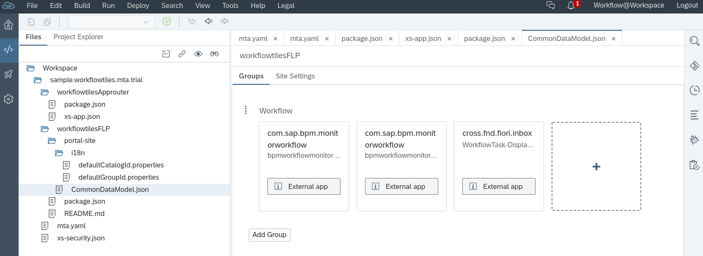
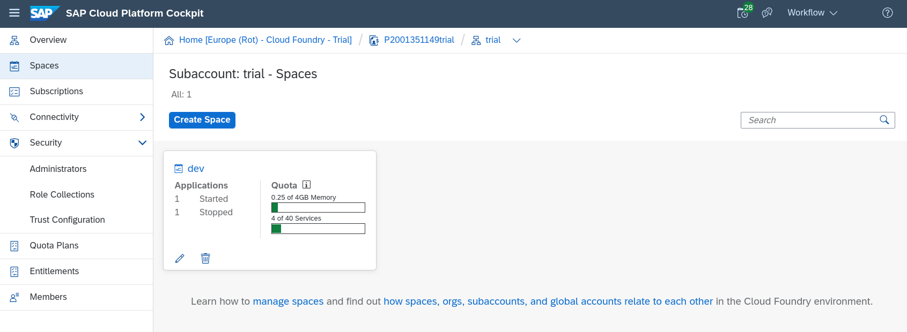
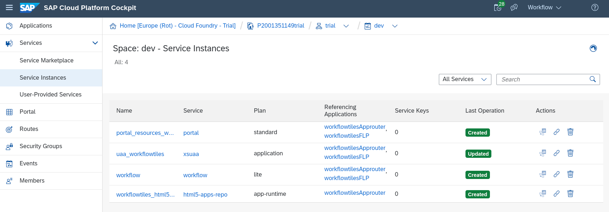
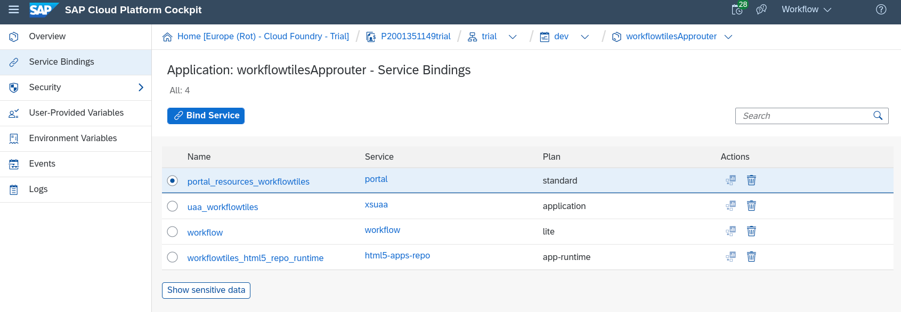

# Exercise 02 - Deploying the Workflow tools

In this exercise you'll create an initial project from a sample application within the SAP Web IDE. The definitions in this project, once deployed to your Cloud Foundry (CF) environment, will cause the creation of the other platform related services mentioned at the start of the [previous exercise](../01/), and provide you with a Fiori launchpad (FLP) site running via the Portal service.

## Steps

After completing these steps you'll have a Fiori launchpad with an app for viewing and processing Workflow items ("My Inbox") and a pair of apps for managing workflow definitions and instances.

### 1. Create a new project in SAP Web IDE

There is a sample application project that has everything required to set things up from a platform perspective to be able to interact with the Workflow service in your CF environment.

:point_right: In the SAP Web IDE go to the Editor perspective and use the menu path "File -> New -> Project From Sample Application". Find and select the sample application "Workflow Applications on SAP Fiori Launchpad for Cloud Foundry (Trial)", checking and confirming the license agreement:



This results in a new project entry in your workspace, called `sample.workflowtiles.mta.trial`.

The name of this project is somewhat of a mouthful, but it provides some useful contextual information as to what it is:

- "sample": it's a sample application
- "workflowtiles": it provides the FLP with tiles for Workflow activities
- "mta": it's a "multi target application" (see documentation on the [Cloud Foundry MTA Examples](https://github.com/SAP-samples/cf-mta-examples) for more info)
- "trial": related to trial cloud platform activities


### 2. Modify the `mta.yaml` file to reflect the existing workflow service instance

The `mta.yaml` file within the project contains the definitions of the modules that will be deployed, and the resources upon which these modules rely. One resource upon which the two modules in this project rely is, unsurprisingly, an instance of the Workflow service. You've created one already, so in this step you'll make sure that it's properly referenced in this file.

:point_right: Open the `mta.yaml` file, and make sure the "MTA Editor" view is selected at the bottom (this presents a graphical representation of the YAML contents, which can be accessed via the "Code Editor" view):


The MTA Editor presents the contents of the file in three sections - "Modules", "Resources" and "Basic Information". As you can see, there are two modules, and each of them rely upon various resources:

| Module (type) | Requires (type) |
| ------ | -------- |
| `workflowtilesApprouter (approuter.node.js) ` | `workflowtiles_html5_repo_runtime (html5-apps-repo)`, `portal_resources_workflowtiles (portal)`, `uaa_workflowtiles (xsuaa)`, `workflow_workflowtiles (workflow)` |
| `workflowtilesFLP (com.sap.portal.content) ` | `portal_resources_workflowtiles (portal)`, `uaa_workflowtiles (xsuaa)`, `workflow_workflowtiles (workflow)` |

:point_right: Switch between the "Modules" and "Resources" sections to understand these relationships.

The `workflowtilesApprouter` module is the "handle" of a standard application which presents a Portal site. The `workflowtilesFLP` module, when deployed, will cause application and tile definitions to be defined in the FLP site.

Both modules require the `workflow_workflowtiles` resource which is basically an instance of the Workflow service.

:point_right: Switch from the "MTA Editor" to the "Code Editor" to see the raw YAML, and search for the string `workflow_workflowtiles`. You should find three occurrences, marked here with arrows:

```yaml
ID: sample.workflowtiles.mta.trial
_schema-version: '2.1'
parameters:
  deploy_mode: html5-repo
version: 0.0.1
modules:
  - name: workflowtilesApprouter
    type: approuter.nodejs
    path: workflowtilesApprouter
    parameters:
      disk-quota: 256M
      memory: 256M
    requires:
      - name: workflowtiles_html5_repo_runtime
      - name: portal_resources_workflowtiles
      - name: uaa_workflowtiles
      - name: workflow_workflowtiles              -----------+
  - name: workflowtilesFLP                                   |
    type: com.sap.portal.content                             |
    path: workflowtilesFLP                                   |
    parameters:                                              |
      stack: cflinuxfs3                                      |
      memory: 128M                                           |
      buildpack: 'https://github.com/cloudfoundry/nodejs-buildpack/releases/[...]
    requires:                                                |
      - name: portal_resources_workflowtiles                 |
      - name: uaa_workflowtiles                              |
      - name: workflow_workflowtiles              -----------+
resources:                                                   |
  - name: workflowtiles_html5_repo_runtime                   |
    parameters:                                              |
      service-plan: app-runtime                              |
      service: html5-apps-repo                               |
    type: org.cloudfoundry.managed-service                   |
  - name: portal_resources_workflowtiles                     |
    parameters:                                              |
      service-plan: standard                                 |
      service: portal                                        |
    type: org.cloudfoundry.managed-service                   |
  - name: uaa_workflowtiles                                  |
    parameters:                                              |
      path: ./xs-security.json                               |
      service-plan: application                              |
      service: xsuaa                                         |
    type: org.cloudfoundry.managed-service                   |
  - name: workflow_workflowtiles                 <-----------+
    parameters:
      service-plan: lite
      service: workflow
    type: org.cloudfoundry.managed-service
```

The first two references are in the modules' `requires` sections, referring to the third reference, which is the name of the item in the `resources` section.

As you've already created an instance of the Workflow service, with the name "workflow", you must modify the references.

:point_right: First, change each of the three occurrences of `workflow_workflowtiles` to `workflow`.

:point_right: Now, modify the "type" of the `workflow` resource; the instance already exists, so the type should be `org.cloudfoundry.existing-service` rather than `org.cloudfoundry.managed-service`. Make this modification - it should be on the very last line that you see here in this YAML.

As a result of the modifications, each instance of `workflow_workflowtiles` should have been changed, and the last section of the YAML should now look like this:

```yaml
  - name: workflow
    parameters:
      service-plan: lite
      service: workflow
    type: org.cloudfoundry.existing-service
```


### 3. Examine the rest of the content within the project

Expanding the entirety of the project structure will reveal something like this:


It's worth taking a few moments to [stare](https://langram.org/2017/02/19/the-beauty-of-recursion-and-list-machinery/#initialrecognition) at some of the content in this project, to understand some details of what we're about to deploy.

The `workflowtilesApprouter` directory contains definitions which will bring about an application in your CF space that allows you to reach the FLP site with the Workflow related tiles. Notice the reference to `/cp.portal` as the starting resource in the `xs-app.json` configuration file.

The `workflowtilesFLP` directory is a Node.js app that will cause a deployment of artifacts to the portal FLP site. The `package.json` file describes the dependency on a portal "deployer" service that is invoked, and the `portal-site/` directory, in particular via the `CommonDataModel.json` file, contains details of what those artifacts are. Indeed, the SAP Web IDE has a built-in "Launchpad Editor" that will be invoked when you select the file for editing:




### 4. Build the MTA archive ready for deployment

While the project contents are interesting academically, they aren't going to do you much good sitting there in the IDE. So now it's time to compile them into an archive which can be deployed to your CF space. For this, you will invoke a "build" command.

> The previous incarnation of the software that performed the build was a Java-based program, which is now deprecated, superseded by a Node.js based alternative called [mbt](https://www.npmjs.com/package/mbt) - the Multi-Target Application Build Tool. Both tools are still available from the context menu in the SAP Web IDE; the deprecated tool is marked as such and will disappear in time.

:point_right: Use the context menu on the project node in the Files explorer of the SAP Web IDE (i.e. the `sample.workflowtiles.mta.trial` name) and select "Build -> Build with Cloud MTA Build Tool (recommended)". This will start the build process which you can monitor in the console (use the main menu option "View -> Console" to see this, or toggle the console icon in the far right column of the IDE).

Towards the end of the process you'll see log records in the console that look like this:

```
(Executor) [2020-02-26 13:35:27]  INFO generating the MTA archive...
(Executor) [2020-02-26 13:35:27]  INFO the MTA archive generated at: /projects/sample.workflowtiles.mta.trial/mta_archives/sample.workflowtiles.mta.trial_0.0.1.mtar
(Executor) [2020-02-26 13:35:27]  INFO cleaning temporary files...
(Executor)   adding: mta_archives/sample.workflowtiles.mta.trial_0.0.1.mtar (deflated 0%)
(mtaBuildTask) Build of "sample.workflowtiles.mta.trial" completed.
```

You can see that an archive has been generated in a new `mta_archives/` directory. This is what is to be deployed in the next step.

### 5. Deploy the MTA archive to Cloud Foundry

At this stage you're ready to deploy the project contents, in the form of the archive that has just been built, to your CF environment.

:point_right: Use the context menu on the archive file `sample.workflowtiles.mta.trial_0.0.1.mtar` and select "Deploy -> Deploy to SAP Cloud Platform" to start the deployment. At the prompt, enter or confirm the CF environment details that denote your CF organization and space.

After a few minutes the deployment will complete, and you should see a log message in the console like this, towards the end:

```
Application "workflowtilesApprouter" started and available at "p2001351149trial-dev-workflowtilesapprouter.cfapps.eu10.hana.ondemand.com"
```

This is the URL of the `workflowApprouter` module that has been deployed, and will be specific to your SAP Cloud Platform trial user ID. You can use this URL to get to the FLP site, but instead, let's take another route.


### 6. Find the FLP site URL and get to the Workflow tiles

In the final step in this exercise, you should get to the Workflow tiles in the Fiori launchpad that's been created in the Portal service, an instance of which has been created during the course of the deployment.

:point_right: Back in the SAP Cloud Platform Cockpit, go to the "Spaces" view in your trial subaccount (you visited this view in [the previous exercise](../01/)) and notice that the quota has now changed again:



This reflects the applications and service instances that now exist due to the deployment.

:point_right: Select the "dev" space and you should be brought initially to the list of applications. There you should see the `workflowtilesApprouter` and `workflowtilesFLP` applications you saw referenced in the `mta.yaml` file earlier.

> The `workflowtilesFLP` application will most likely be in the "Stopped" state, reflecting the completion of the "deployer" service execution.

:point_right: Now select the "Service Instances" menu item, whereupon you will be shown not only the `workflow` service instance that you created explicitly, in the previous exercise, but also instances of the `portal`, `xsuaa` and `html5-apps-repo` services. Notice how there are entries in the "Referencing Applications" column, reflecting the links between the modules and the resources described in the `mta.yaml` file:



:point_right: From here, select one of the `workflowtilesApprouter` links in the "Referencing Applications" column to quickly jump to the details of that application; it will take you initially to the "Service Bindings" section:



:point_right: From there select the "Overview" menu item to see general information about the `workflowtilesApprouter` application, which includes the "Application Routes" section. There's a single route URL shown for this application, and yes, you guessed it, it's the one shown in the deployment log earlier:


Select the route URL and, after the standard authentication challenge screen, which you must complete using your SAP Cloud Platform trial email address and password, you'll see what you've been waiting for this whole time - a lovely Fiori launchpad site with the "My Inbox" and "Monitor Workflows" tiles:


## Summary

Not only do you have an instance of the main workflow service now, but also access to your own FLP site with the "My Inbox" app for managing workflow related task items, and a pair of apps for managing workflow definitions and instances. But you also have some insight into how MTAs work and what the relationship is between modules and resources defined in MTA descriptor files.

Good work!


## Questions

1. Why is the `workflowtilesFLP` app not listed in the "Referencing Applications" column for the instance of the `html5-apps-repo` service?

1. What do you think the difference between a "workflow instance" and a "workflow definition" is?

1. Can you find out what the ID of the "Monitor Workflow" app is, that is accessed through the two "Monitor Workflow" tiles?
