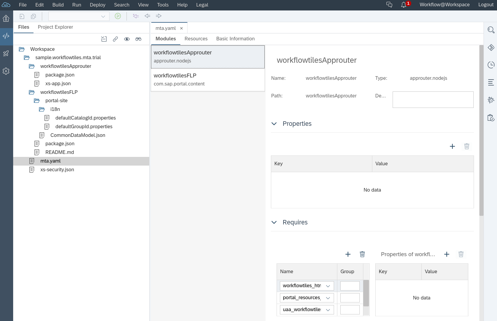
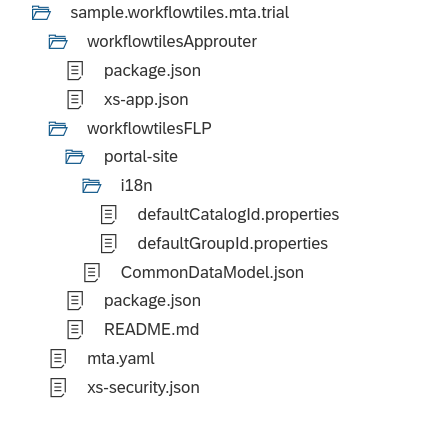

# Exercise 02 - Creating an initial platform project

In this exercise you'll create an initial project from a sample application within the SAP Web IDE. The definitions in this project, once deployed to your Cloud Foundry (CF) environment, will cause the creation of the other platform related services mentioned at the start of the [previous exercise](../01/), and provide you with a Fiori launchpad (FLP) site running via the Portal service.

## Steps

After completing these steps you'll have a Fiori launchpad with an app for viewing and processing Workflow items ("My Inbox") and a pair of apps for managing workflow definitions and instances.

### 1. Create a new project in SAP Web IDE

There is a sample application project that has everything required to set things up from a platform perspective to be able to interact with the Workflow service in your CF environment.

:point_right: In the SAP Web IDE go to the Editor perspective and use the menu path "File -> New -> Project From Sample Application". Find and select the sample application "Workflow Applications on SAP Fiori Launchpad for Cloud Foundry (Trial)", checking and confirming the license agreement:


This results in a new project entry in your workspace, called `sample.workflowtiles.mta.trial`.

The name of this project is somewhat of a mouthful, but it provides some useful contextual information as to what it is:

- "sample": it's a sample application
- "workflowtiles": it provides the FLP with tiles for Workflow activities
- "mta": it's a "multi target application" (see documentation on the [Cloud Foundry MTA Examples](https://github.com/SAP-samples/cf-mta-examples) for more info)
- "trial": related to trial cloud platform activities


### 2. Modify the `mta.yaml` file to reflect the existing workflow service instance

The `mta.yaml` file within the project contains the definitions of the modules that will be deployed, and the resources upon which these modules rely. One resource upon which the two modules in this project rely is, unsurprisingly, an instance of the Workflow service. You've created one already, so in this step you'll make sure that it's properly referenced in this file.

:point_right: Open the `mta.yaml` file, and make sure the "MTA Editor" view is selected at the bottom (this presents a graphical representation of the YAML contents, which can be accessed via the "Code Editor" view):



The MTA Editor presents the contents of the file in three sections - "Modules", "Resources" and "Basic Information". As you can see, there are two modules, and each of them rely upon various resources:

| Module (type) | Requires (type) |
| ------ | -------- |
| `workflowtilesApprouter (approuter.node.js) ` | `workflowtiles_html5_repo_runtime (html5-apps-repo)`, `portal_resources_workflowtiles (portal)`, `uaa_workflowtiles (xsuaa)`, `workflow_workflowtiles (workflow)` |
| `workflowtilesFLP (com.sap.portal.content) ` | `portal_resources_workflowtiles (portal)`, `uaa_workflowtiles (xsuaa)`, `workflow_workflowtiles (workflow)` |

:point_right: Switch between the "Modules" and "Resources" sections to understand these relationships.

The `workflowtilesApprouter` module is the "handle" of a standard application which presents a Portal site. The `workflowtilesFLP` module, when deployed, will cause application and tile definitions to be defined in the FLP site.

Both modules require the `workflow_workflowtiles` resource which is basically an instance of the Workflow service.

:point_right: Switch from the "MTA Editor" to the "Code Editor" to see the raw YAML, and search for the string `workflow_workflowtiles`. You should find three occurrences, marked here with arrows:

```yaml
ID: sample.workflowtiles.mta.trial
_schema-version: '2.1'
parameters:
  deploy_mode: html5-repo
version: 0.0.1
modules:
  - name: workflowtilesApprouter
    type: approuter.nodejs
    path: workflowtilesApprouter
    parameters:
      disk-quota: 256M
      memory: 256M
    requires:
      - name: workflowtiles_html5_repo_runtime
      - name: portal_resources_workflowtiles
      - name: uaa_workflowtiles
      - name: workflow_workflowtiles              -----------+
  - name: workflowtilesFLP                                   |
    type: com.sap.portal.content                             |
    path: workflowtilesFLP                                   |
    parameters:                                              |
      stack: cflinuxfs3                                      |
      memory: 128M                                           |
      buildpack: 'https://github.com/cloudfoundry/nodejs-buildpack/releases/[...]
    requires:                                                |
      - name: portal_resources_workflowtiles                 |
      - name: uaa_workflowtiles                              |
      - name: workflow_workflowtiles              -----------+
resources:                                                   |
  - name: workflowtiles_html5_repo_runtime                   |
    parameters:                                              |
      service-plan: app-runtime                              |
      service: html5-apps-repo                               |
    type: org.cloudfoundry.managed-service                   |
  - name: portal_resources_workflowtiles                     |
    parameters:                                              |
      service-plan: standard                                 |
      service: portal                                        |
    type: org.cloudfoundry.managed-service                   |
  - name: uaa_workflowtiles                                  |
    parameters:                                              |
      path: ./xs-security.json                               |
      service-plan: application                              |
      service: xsuaa                                         |
    type: org.cloudfoundry.managed-service                   |
  - name: workflow_workflowtiles                 <-----------+
    parameters:
      service-plan: lite
      service: workflow
    type: org.cloudfoundry.managed-service
```

The first two references are in the modules' `requires` sections, referring to the third reference, which is the name of the item in the `resources` section.

As you've already created an instance of the Workflow service, with the name "workflow", you must modify the references.

:point_right: First, change each of the three occurrences of `workflow_workflowtiles` to `workflow`.

:point_right: Now, modify the "type" of the `workflow` resource; the instance already exists, so the type should be `org.cloudfoundry.existing-service` rather than `org.cloudfoundry.managed-service`. Make this modification - it should be on the very last line that you see here in this YAML.

As a result of the modifications, each instance of `workflow_workflowtiles` should have been changed, and the last section of the YAML should now look like this:

```yaml
  - name: workflow
    parameters:
      service-plan: lite
      service: workflow
    type: org.cloudfoundry.existing-service
```


### 3. Examine the rest of the content within the project

Expanding the entirety of the project structure will reveal something like this:



It's worth taking a few moments to [stare](https://langram.org/2017/02/19/the-beauty-of-recursion-and-list-machinery/#initialrecognition) at some of the content in this project, to understand some details of what we're about to deploy.

The `workflowtilesApprouter` directory contains definitions which will bring about an application in your CF space that allows you to reach the FLP site with the Workflow related tiles. Notice the reference to `/cp.portal` as the starting resource in the `xs-app.json` configuration file.

The `workflowtilesFLP` directory is a Node.js app that will cause a deployment of artifacts to the portal FLP site. The `package.json` file describes the dependency on a portal "deployer" service that is invoked, and the `portal-site/` directory, in particular via the `CommonDataModel.json` file, contains details of what those artifacts are. Indeed, the SAP Web IDE has a built-in "Launchpad Editor" that will be invoked when you select the file for editing:


