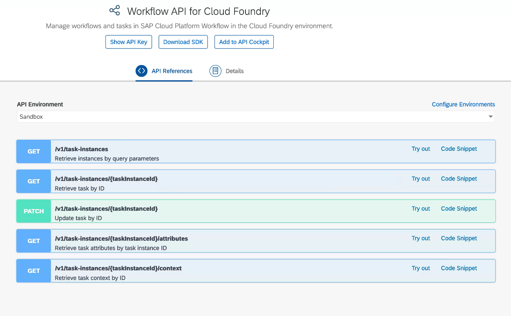

# Exercise 06 - Exploring the API Hub and the Workflow API

In this exercise you'll take a look at the details of the Workflow service API in the SAP API Business Hub, and use the API to create an instance of your `orderprocess` definition.

## Steps

After completing these steps you'll have set up an environment in the SAP API Business Hub that reflects the details of your personal trial account, and tried out a couple of API calls to start off a workflow via the API.

### 1. Log on to SAP API Business Hub

:point_right: Go to the [SAP API Business Hub](https://api.sap.com/) and log on.

This is the central place for discovery and consumption of APIs - see it as your "one stop shop" to learn about and try out APIs in the SAP universe. Take a few moments to look around and familiarize yourself with the site.

### 2. Find the Workflow API

The Workflow API is of course documented and available for exploration here in the API Hub.

:point_right: [Search for](https://api.sap.com/search?searchterm=workflow%20API) the Workflow API - you should find a number of results. The one we're interested in for this CodeJam is the [Workflow API for Neo](https://api.sap.com/api/SAP_CP_Workflow/resource). You should see something like this:

It describes the different aspects that the API covers, such as:

- User Task Instances
- Workflow Definitions
- Workflow Instances
- Forms

and so on.

For each aspect there are a number of verb/noun combinations, in the form of HTTP methods (representing the verbs) and URL paths (representing the nouns). This noun/verb approach suggests that the Workflow API exhibits some qualities of the Representational State Transfer (REST) architectural style.

:point_right: Explore each of the aspects, in particular "Workflow Instances" and "XSRF Handling". Try to identify which verb/noun combination in the "Workflow Instances" aspect would be appropriate to create a new instance of a workflow definition.

### 3. Configure an API Environment

In the API Hub you can not only explore but try out APIs. For this, there's a sandbox environment provided, but it's better and more convenient to set up an API environment that reflects your setup. In this step you'll do just that, setting up an API environment that reflects your SAP Cloud Platform trial account and the Workflow service you have enabled there.

:point_right: At the top of the Workflow API details, select the "Configure Environments" link to get to a dialog where you can create a new environment. You should see something like this:

You should be defaulted to the "Create New Environment" mode.

:point_right: Specify the following values, noting that the Starting URL selection needs to be based on the fact that you are using your trial account in the Neo environment:

| Property       | Value                   |
| -------------- | ----------------------- |
| Starting URL   | ` https://bpmworkflowruntime{provideraccountname}-{consumeraccountname}.hanatrial.ondemand.com/workflow-service/rest
` |
| Display Name for Environments | MyCodeJamEnv |
| provideraccountname           | wfs          |
| consumeraccountname           | <your trial account, e.g. p2001351149trial> |
| Authentication Type           | Basic Authentication |
| Username                      | <your trial account username, e.g. p2001351149 > |
| Password                      | <your trial account password> |
| Apply this environment to all APIs in this package that are not yet configured | _checked_ |
| Save this environment for future sessions | _selected_ |

...

## Summary

You've now ...

## Questions

1. ...

