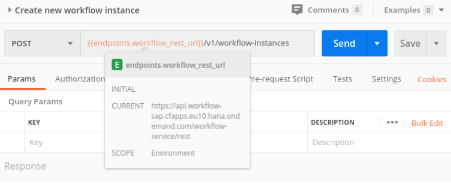
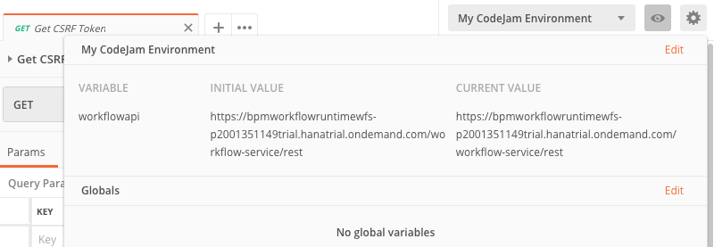
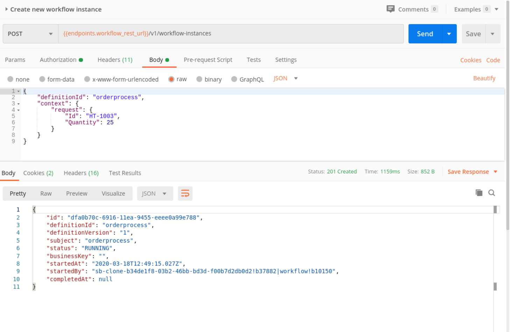

# Exercise 07 - Calling the Workflow API from Postman

In the previous exercise you used the SAP API Business Hub to explore and use the Workflow API. With the confidence gained in those steps, it's now time to make similar calls, to create a new workflow instance, from a 3rd party API client - Postman.

Postman is a very capable HTTP client with many features. In this exercise you'll use some of them:

- Collections and the Collection Runner
- Environments & variables

Using these features, you can achieve a semi-automated mechanism for creating new instances of your "orderprocess" workflow definition.

## Steps

After completing these steps you'll know how to instantiate new workflows from Postman (and, by inference, from other API clients and tools).

### 1. Open Postman and import the Workflow CodeJam collection

The two API calls you made in a previous exercise have been encapsulated into a small Postman collection that you can import and use.

:point_right: Launch Postman and get ready to import a collection using the "Import From Link" feature in this dialog box that you get when you select the "Import" button at the top left of the Postman UI:


:point_right: In the dialog, specify the URL to this [workflowcodejamcollection.json](https://raw.githubusercontent.com/SAP-samples/cloud-workflow-codejam/master/exercises/07/workflowcodejamcollection.json) resource, and use the "Import" button to complete the process.

### 2. Create a new Postman environment

Postman offers the facility to manage collections of settings that pertain to different contexts, for example you might have a couple of development contexts and system endpoints, and a production context. These are called "environments" in Postman and in this step you will create one to store the details of your specific SAP Cloud Platform trial account context.

Within environments you can use variables, and the environment-specific values for these are substituted at runtime.

:point_right: Examine how these variables are used, by looking at the first of the two requests in the collection you imported in the previous step. Expand the hierarchy of the "Workflow CodeJam" collection and select the first request "Get CSRF Token".

You should see something like this:


:point_right: Notice the use of the `{{workflowapi}}` variable in the URL, and the fact also that currently, indicated in the top right of the Postman UI, there is "No Environment" set.

:point_right: Use the "Manage Environments" button (the cog) in the top right to open up a dialog where you can add an environment, and then use the "Add" button and specify the following values in the "Add Environment" form that follows:

| Property               | Value                   |
| -------------          | ----------------------- |
| Environment Name       | My CodeJam Environment  |
| Variable               | `workflowapi`           |
| Initial Value          | \<the Workflow service API root\> |
| Current Value          | (_this will take the value of what you specify for the "Initial Value" property_) |

The "Workflow service API root" is the one that you looked at in Exercise 06 when you [configured an API environment](../06/readme.md#3-configure-an-api-environment), with both the "provideraccountname" and the "consumeraccountname" substituted with real values. For example, this would be the following for the trial account "p2001351149trial":

```
https://bpmworkflowruntimewfs-p2001351149trial.hanatrial.ondemand.com/workflow-service/rest
```

_Note: Remember to use your own trial account name here!_

:point_right: Ensure that the "Current Value" property also reflects what you entered into the "Initial Value" property and then complete the setup, ensuring everything is saved.

### 3. Select the new environment for use

Once you've finished adding this new environment, you should select it for use.

:point_right: Select the new environment from the drop-down selection that you saw earlier (it was set to "No Environment" at that time). Then notice that the `{{workflowapi}}` variable in the URL has turned from red, indicating the variable wasn't defined, to a slightly more orange color, and when you hover over it the value is displayed:




### 4. Add authentication details to the collection

The "Workflow CodeJam" collection of two requests you imported earlier in this exercise has no authentication details associated with it. In this step, you can add your own authentication details to the collection, which will then be inherited by each request contained within it.

:point_right: Use the context menu (right-click) on the "Workflow CodeJam" collection, or the three dots next to the name, and select "Edit", as shown:


:point_right: In the "Edit Collection" dialog, switch to the "Authorization" tab and select "Basic Auth" as the type, adding your trial account username and password before selecting the "Update" button at the bottom to save everything.


### 5. Examine the rest of the requests' details

In this step you'll take a look at the details of each of the two requests, to understand how they work together.

:point_right: First, in the "GET CSRF Token" request, look at the "Headers" tab. You should see that the header "X-CSRF-Token" is supplied, with the value "Fetch", just like you used in Exercise 06.

:point_right: Now, look in the "Tests" tab and you should see some JavaScript that looks like this:

```javascript
postman.setEnvironmentVariable("xsrftoken", postman.getResponseHeader("X-CSRF-Token"));
```

Test scripts are run after a request is executed - here, the value of the token received in the response to the request is saved in another environment variable "xsrftoken".

:point_right: Now select the second request "Create new workflow instance", and look in the "Headers" tab. You'll see the "Content-Type" header supplied, but also the "X-CSRF-Token" header where the value is set to `{{xsrftoken}}`. When the request is run, the current value of that variable - set when the "Get CSRF Token" request is executed - will be substituted.

:point_right: Look at the "Body" tab and you should see something that looks familiar - a request body similar to the one you specified in Exercise 06 when you [created a new workflow instance](../06/readme.md#5-create-a-new-workflow-instance-via-the-api):

```json
{
  "definitionId" : "orderprocess",
  "context": {
    "request": {
      "Id": "HT-1003",
      "Quantity": 25
    }
  }
}
```

### 6. Run the requests manually

Now it's time to put the requests to use.

:point_right: Before you do, look briefly at the context of your new environment "My CodeJam Environment" using the "eye" button in the top right, and notice that the "workflowapi" variable is set, but there isn't yet any mention of the "xsrftoken" variable:



:point_right: Now run the "Get CSRF Token" request, using the "Send" button. Once the request completes, it looks as if there's no result. That's just because there's no body in the response, of course. Check in the "Headers" tab of the response, and you should see that a CSRF token has indeed been supplied. Note also that the status code is 200:


:point_right: Take another look at the environment context like you did in the previous step - you should now see the "xsrftoken" variable, with the value set to the token just returned.

:point_right: Now select the second request "Create new workflow instance". Before running it, take a peek at the "Headers" tab in the request detail, and confirm that the `{{xsrftoken}}` variable is indeed orange now rather than red, and that hovering over it shows the token value.

:point_right: Run the second request with the "Send" button and examine the response. This time of course you should see something in the response body - similar to what you saw in the response body in Exercise 06 when you created a new workflow instance. Note too that the HTTP status code is, as expected, 201.



Great!

### 7. Run the request in a semi-automated manner

You can also use a Postman feature to run requests sequentially in a semi-automated manner, using the Collection Runner.

:point_right: Use the small arrow to the right of the collection name to reveal a blue "Run" button, and press it. A new Postman window opens up revealing the Collection Runner:


:point_right: Use the big blue button "Run Workflow CodeJam" at the bottom to run the requests in the collection. Examine the results that show that both requests have completed, the first with HTTP status code 200 and the second with HTTP status code 201:


### 8. Check the new instances in the Fiori launchpad

As a final step in this exercise, you should check the newly created instances in your Fiori launchpad.

:point_right: Open up your Fiori launchpad and select the "Monitor Workflows - Workflow Instances" app. Make sure that the filter in the master list includes the status "Completed". You should see the instances you have created via Postman - you can identify them by the fact that product with ID "HT-1003" (rather than "HT-1002" or "HT-1001") has been requested.

Nice work!

## Summary

You've now got a Postman environment set up, with a simple collection of two requests that work together, and that can be conveniently run together to create workflow instances.

## Questions

1. What other HTTP client tools might you have in mind to use instead of (or in addition to) Postman?

1. Do you really need to fetch a CSRF token each and every time?

1. How do you think the authentication details at the collection level flow down to be used in the individual requests?
