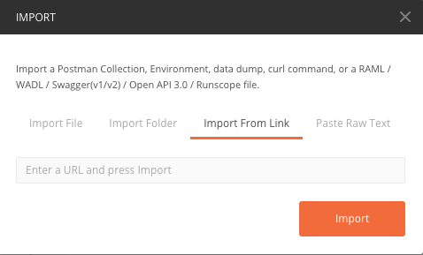

# Exercise 07 - Calling the Workflow API from Postman

In the previous exercise you used the SAP API Business Hub to explore and use the Workflow API. With the confidence gained in those steps, it's now time to make similar calls, to create a new workflow instance, from a 3rd party API client - Postman.

Postman is a very capable HTTP client with many features. In this exercise you'll use some of them:

- Collections and the Collection Runner
- Environments & variables

Using these features, you can achieve a semi-automated mechanism for creating new instances of your "orderprocess" workflow definition.

## Steps

After completing these steps you'll know how to instantiate new workflows from Postman (and, by inference, from other API clients and tools).

### 1. Open Postman and import the Workflow CodeJam collection

The two API calls you made in a previous exercise have been encapsulated into a small Postman collection that you can import and use.

:point_right: Launch Postman and get ready to import a collection using the "Import From Link" feature in this dialog box that you get when you select the "Import" button at the top left of the Postman UI:

:point_right: In the dialog, specify the URL to this [workflowcodejamcollection.json](https://raw.githubusercontent.com/SAP/cloud-workflow-codejam/master/exercises/07/workflowcodejamcollection.json) resource, and use the "Import" button to complete the process.

...

## Summary

You've now ...

## Questions

1. ...

