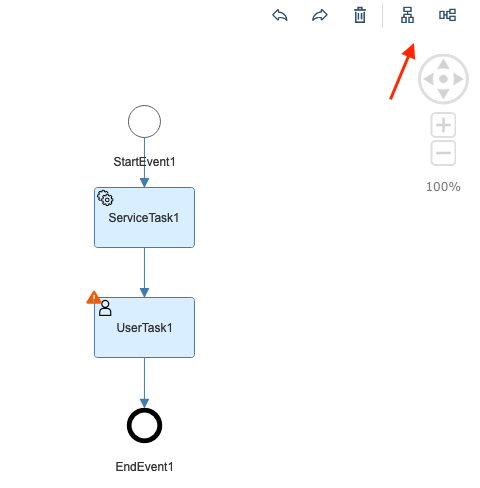

# Exercise 09 - Adding a User Task to the workflow definition

In this exercise you'll enhance the workflow definition by adding a User Task to it, so that a decision point can be presented to a person in the My Inbox app.

## Steps

After completing these steps you'll have a User Task in your workflow definition that presents information from the workflow instance context, and asks for a decision.

### 1. Open up the workflow definition in the SAP Web IDE Full-Stack

:point_right: Open up the SAP Web IDE Full-Stack that you enabled and used in [Exercise 05](../05). Once the IDE has started up, open the `orderprocess.workflow` workflow definition that should show your definition with the Service Task between the start and end events.

### 2. Add a User Task

:point_right: In a similar way to how you added a Service Task in [Exercise 08](../08/),  use the Tasks menu in the graphical workflow editor to add a User Task, and place it after the Service Task, and before the end event.

_Note: You can make use of the "Arrange Vertically" and "Arrange Horizontally" buttons in the editor to tidy up the graphical flow after adding items to the definition._

The User Task requires certain settings. First though, let's change the name of the User Task, as well as the Service Task, so they are more meaningful in the editor.

:point_right: Select the User Task and in the "General" tab of the "User Task Properties" on the right hand side, specify the value "Approval Descision". Then select the Service Task and make a similar change, changing the current value of "ServiceTask1" to "Retrieve Product Info". Don't forget to save.

Now it's time to specify the settings.

:point_right: In the "Details" tab of the "User Task Properties", specify the following values:

| Property     | Value          |
| ------------ | -------------- |
| Priority     | (keep at "Medium" or change if you wish) |
| Subject      | `Request for ${context.productInfo.d.Name}` |
| Description  | `Please review this request for ${context.request.Quantity} items.` |
| Users        | \<your SAP Cloud Platform trial account username\> |
| Group        | (leave blank)  |
| Configure Due Date | (leave unchecked) |

_Note: The user assignment is case sensitive, so it's important that you specify your username with a capital letter at the beginning, for example `P2001351149` not `p2001351149`._

_Note: Within the context of the trial account you are using (with only a single user - you - available), it makes sense to specify yourself as a recipient of the user task items.In other situations this could be a calculated value, or the "Group" property could be used instead._

...

## Summary

You've now ...

## Questions

1. ...

